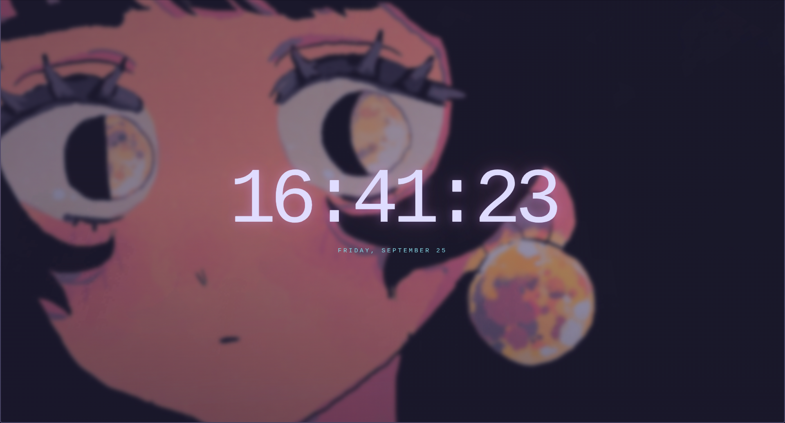

# Clean Tab

Clean Tab is a Manifest V3 Chrome extension that replaces the New Tab page
with a Rose Pine-themed live clock, date, and softly blurred wallpaper.

The extension is entirely local. It has no permissions, background worker,
network requests, analytics, accounts, or external JavaScript.

## Files

- `manifest.json` — Manifest V3 configuration and New Tab override.
- `start.html` — New Tab page markup and styling.
- `clock.js` — Local clock and date updates.
- `assets/earrings.jpg` — Wallpaper bundled with the extension.

## Preview



## Load it unpacked in Chrome

1. Open `chrome://extensions`.
2. Turn on **Developer mode**.
3. Click **Load unpacked**.
4. Select this repository folder the folder containing `manifest.json`.
5. Open a new Chrome tab.

After changing any file, return to `chrome://extensions`, click the extension's
**Reload** button, and open a new tab.

## Update the wallpaper

Replace `assets/earrings.jpg` with the image you want to use:

```sh
cp /path/to/new-wallpaper.jpg assets/earrings.jpg
```

Keep the file name unchanged, or update the `--wallpaper` path in
`start.html` to match the new file name. The image must be inside the
extension folder; do not use a `file:///` path from your home directory.

